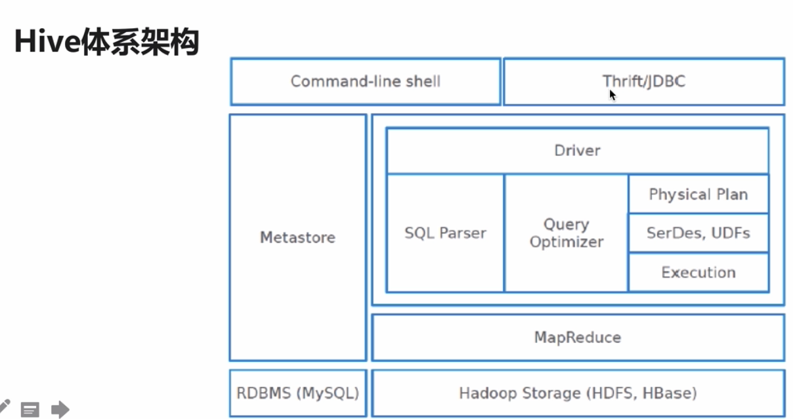
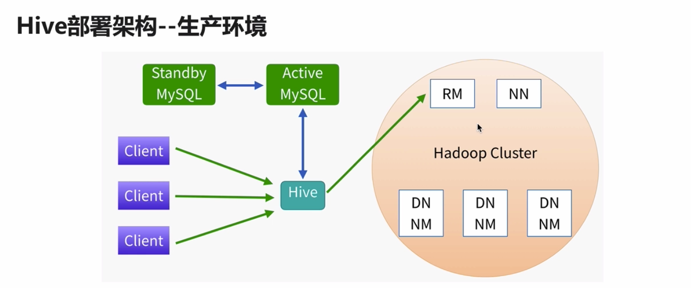

## Hive

- 由Facebook开源/最初用于解决海量结构化的日志数据统计问题 
- 构建在Hadoop之上的数据仓库 
- Hive定义了一种类SQL查询语言：HQL（类似SQL但不完全相同）

### 为什么要使用Hive

- 简单、容易上手（提供了类似SQL查询语言HQL） 
- 为超大数据集设计的计算/存储扩展能力(MR计算，HDFS存储） 
- 统一的元数据管理（可与Prestro/impala/SparkSQL等共享数据）

## Hive体系架构

## Hive 安装

Hive环境搭建
1）Hive下载：http://archive.cloudera.com/cdh5/cdh/5/
	wget http://archive.cloudera.com/cdh5/cdh/5/hive-1.1.0-cdh5.7.0.tar.gz

2）解压
	tar -zxvf hive-1.1.0-cdh5.7.0.tar.gz -C ~/app/

3）配置
	系统环境变量(~/.bahs_profile)
		export HIVE_HOME=/home/hadoop/app/hive-1.1.0-cdh5.7.0
		export PATH=$HIVE_HOME/bin:$PATH

	实现安装一个mysql， yum install xxx

	hive-site.xml
	<property>
  		<name>javax.jdo.option.ConnectionURL</name>
    	<value>jdbc:mysql://localhost:3306/sparksql?createDatabaseIfNotExist=true</value>
    </property>
    
	<property>
    	<name>javax.jdo.option.ConnectionDriverName</name>
        <value>com.mysql.jdbc.Driver</value>
   	</property>

	<property>
  		<name>javax.jdo.option.ConnectionUserName</name>
    	<value>root</value>
    </property>

	<property>
  		<name>javax.jdo.option.ConnectionPassword</name>
    	<value>root</value>
    </property>

4）拷贝mysql驱动到$HIVE_HOME/lib/

5）启动hive: $HIVE_HOME/bin/hive
