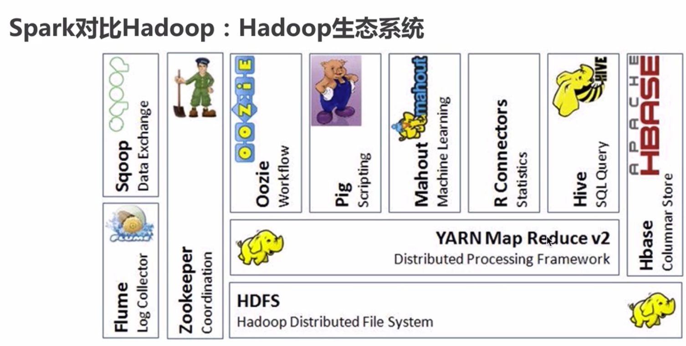
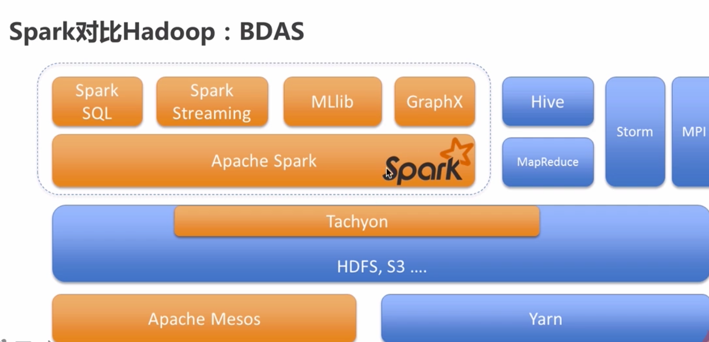
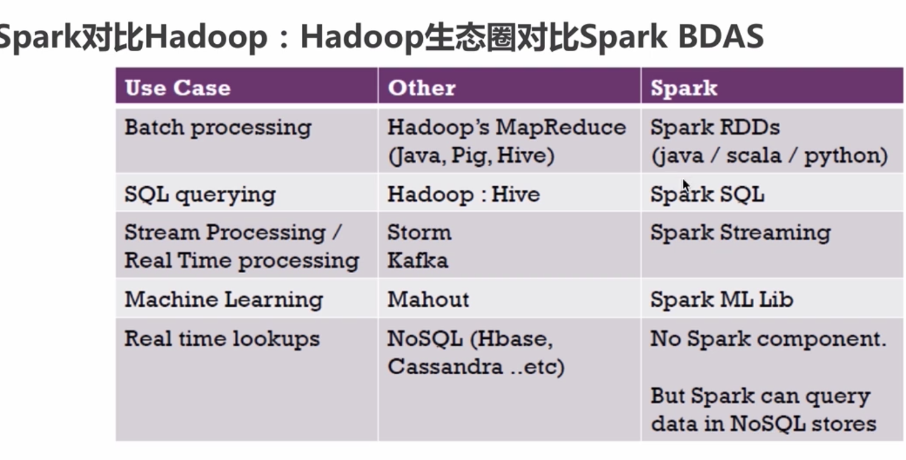

# Spark SQL

## MapReduce 槽点

### 吐槽点1
	需求：统计单词出现的个数（词频统计）
	file中每个单词出现的次数
		hello,hello,hello
		world,world
		pk
		1）读取file中每一行的数据
		2) 按照分隔符把每一行的内容进行拆分
		3）按照相同的key分发到同一个任务上去进行累加的操作
		
		
	这是一个简单的不能再简单的一个需求，我们需要开发很多的代码
		1）自定义Mapper
		2）自定义Reducer
		3）通过Driver把Mapper和Reducer串起来
		4）打包，上传到集群上去
		5）在集群上提交我们的wc程序		
	一句话：就是会花费非常多的时间在非业务逻辑改动的工作上	

### 吐槽点2

    Input => MapReduce ==> Output ==> MapReduce ==> Output
    	回顾下MapReduce执行流程：
    		MapTask或者ReduceTask都是进程级别
    		第一个MR的输出要先落地，然后第二个MR把第一个MR的输出当做输入
    		中间过程的数据是要落地

## Spark特性
    1）Speed
        both batch and streaming data
        批流一体 Spark Flink

        快：从哪些角度来知道快呢？
        1、消除了冗余的HDFS读写
        Hadoop每次shuffle操作后，必须写到磁盘，而Spark在shuffle后不一定落盘，可以cache到内存中，以便迭代时使用。如果操作复杂，很多的shufle操作，那么Hadoop的读写IO时间会大大增加。
        
        2、消除了冗余的MapReduce阶段
        Hadoop的shuffle操作一定连着完整的MapReduce操作，冗余繁琐。而Spark基于RDD提供了丰富的算子操作，且reduce操作产生shuffle数据，可以缓存在内存中。
        
        3、JVM的优化
        Hadoop每次MapReduce操作，启动一个Task便会启动一次JVM，基于进程的操作。而Spark每次MapReduce操作是基于线程的，只在启动Executor是启动一次JVM，内存的Task操作是在线程复用的。
        
        4、Spark是基于内存进行数据处理的，MapReduce是基于磁盘进行数据处理的
        
        5.spark 基于DAG模式的
    
    2）Ease of Use
    	high-level operators	
    
    3）Generality
    	stack  栈   生态
    
    4）Runs Everywhere
        It can access diverse data sources
        YARN/Local/Standalone Spark应用程序的代码需要改动吗？
        --master来指定你的Spark应用程序将要运行在什么模式下
     
### Spark 运行模式
    
- local：本地运行，在开发代码的时候，我们使用该模式进行测试是非常方便的
- standalone：Hadoop部署多个节点的，同理Spark可以部署多个节点  用的不多
- YARN：将Spark作业提交到Hadoop(YARN)集群中运行，Spark仅仅只是一个客户端而已
- Mesos
- K8S：2.3版本才正式稍微稳定   是未来比较好的一个方向
- 补充：运行模式和代码没有任何关系，同一份代码可以不做修改运行在不同的运行模式下

### MVN+IDEA 生成文件

#### pom.xml
    mvn archetype:generate -DarchetypeGroupId=net.alchim31.maven \
    -DarchetypeArtifactId=scala-archetype-simple \
    -DremoteRepositories=http://scala-tools.org/repo-releases \
    -DarchetypeVersion=1.5 \
    -DgroupId=com.bigdata \
    -DartifactId=sparksql-train \
    -Dversion=1.0
    <properties>
        <maven.compiler.source>1.8</maven.compiler.source>
        <maven.compiler.target>1.8</maven.compiler.target>
        <encoding>UTF-8</encoding>
        <scala.tools.version>2.11</scala.tools.version>
        <scala.version>2.11.8</scala.version>
        <spark.version>2.4.3</spark.version>
        <hadoop.version>2.6.0-cdh5.15.1</hadoop.version>
    </properties>	
    
    添加CDH的仓库
    <repositories>
        <repository>
            <id>cloudera</id>
            <url>https://repository.cloudera.com/artifactory/cloudera-repos</url>
        </repository>
    </repositories>
    
    添加Spark SQL和Hadoop Client的依赖
    <!--Spark SQL依赖-->
    <dependency>
        <groupId>org.apache.spark</groupId>
        <artifactId>spark-sql_2.11</artifactId>
        <version>${spark.version}</version>
    </dependency>
    
    <!-- Hadoop相关依赖-->
    <dependency>
        <groupId>org.apache.hadoop</groupId>
        <artifactId>hadoop-client</artifactId>
        <version>${hadoop.version}</version>
    </dependency>
### 词频统计案例
    输入：文件
    需求：统计出文件中每个单词出现的次数
    	1）读每一行数据
    	2）按照分隔符把每一行的数据拆成单词
    	3）每个单词赋上次数为1
    	4）按照单词进行分发，然后统计单词出现的次数
    	5）把结果输出到文件中
    输出：文件
    
      spark-submit --class main.scala.com.bigdata.SparkWordCountAppV2 
    --master local /Users/hui/Desktop/Hadoop/Spark-SQL/Spark-SQL/Spark-SQL/sparksql-train/target/ sparksql-train-1.0.jar
    file:///Users/hui/Desktop/Hadoop/Spark-SQL/Spark-SQL/Spark-SQL/sparksql-train/data/input2.txt file:///Users/hui/Desktop/Hadoop/Spark-SQL/Spark-SQL/Spark-SQL/sparksql-train/data/output/

     spark-submit --class main.scala.com.bigdata.SparkWordCountAppV2 --master yarn /Users/hui/Desktop/Hadoop/Spark-SQL/Spark-SQL/Spark-SQL/sparksql-train/target/sparksql-train-1.0.jar hdfs://localhost:8020/data/input2.txt file:///Users/hui/Desktop/Hadoop/Spark-SQL/Spark-SQL/Spark-SQL/sparksql-train/data/output/

    standalone 模式
    
## Hadoop vs Spark

## Spark-SQL 快速入门
     为什么需要SQL？
         事实上的标准
             MySQL/Oracle/DB2...  RBDMS 关系型数据库  是不是过时呢？
             数据规模  大数据的处理
     
             MR：Java
             Spark：Scala、Java、Python
     
             直接使用SQL语句来对数据进行处理分析呢？  符合市场的需求
                 Hive SparkSQL Impala...
     
         受众面大、容易上手、易学易用
             DDL DML
     
             access.log
             1,zhangsan,10,beijing
             2,lisi,11,shanghai
             3,wangwu,12,shenzhen
     
             table: Hive/Spark SQL/Impala   共享元数据
                 name: access
                 columns: id int,name string,age int,city string
             SQL: select xxx from access where ... group by ... having....
        
        SQL on Hadoop
            使用SQL语句对大数据进行统计分析，数据是在Hadoop
        
            Apache Hive
                SQL转换成一系列可以在Hadoop上运行的MapReduce/Tez/Spark作业
                SQL到底底层是运行在哪种分布式引擎之上的，是可以通过一个参数来设置
                功能：
                    SQL：命令行、代码
                    多语言Apache Thrift驱动
                    自定义的UDF函数：按照标准接口实现，打包，加载到Hive中
                    元数据
        
            Cloudera Impala
                使用了自己的执行守护进程集合，一般情况下这些进程是需要与Hadoop DN安装在一个节点上
                功能：
                    92 SQL支持
                    Hive支持
                    命令行、代码
                    与Hive能够共享元数据
                    性能方面是Hive要快速一些，基于内存
        
            Spark SQL
                Spark中的一个子模块，是不是仅仅只用SQL来处理呢？
                Hive：SQL ==> MapReduce
                Spark：能不能直接把SQL运行在Spark引擎之上呢？
                    Shark： SQL==>Spark      X
                        优点：快  与Hive能够兼容
                        缺点：执行计划优化完全依赖于Hive  MR进程 vs Spark线程
                        使用：需要独立维护一个打了补丁的Hive源码分支
        
                ==>
                    1） Spark SQL
                        SQL，这是Spark里面的
                    2） Hive on Spark
                        Hive里面的，通过切换Hive的执行引擎即可，底层添加了Spark执行引擎的支持
        
        
            Presto
                交互式查询引擎  SQL
                功能
                    共享元数据信息
                    92语法
                    提供了一系列的连接器，Hive Cassandra...
        
            Drill
                HDFS、Hive、Spark SQL
                支持多种后端存储，然后直接进行各种后端数据的处理
        
        
            Phoenix
                HBase的数据，是要基于API进行查询
                Phoenix使用SQL来查询HBase中的数据
                主要点：如果想查询的快的话，还是取决于ROWKEY的设计
## Spark SQL是什么
    Spark SQL is Apache Spark's module for working with structured data.
    误区一：Spark SQL就是一个SQL处理框架
    
    1）集成性：在Spark编程中无缝对接多种复杂的SQL
    2）统一的数据访问方式：以类似的方式访问多种不同的数据源，而且可以进行相关操作
        spark.read.format("json").load(path)
        spark.read.format("text").load(path)
        spark.read.format("parquet").load(path)
        spark.read.format("json").option("...","...").load(path)
    3) 兼容Hive
            allowing you to access existing Hive warehouses
            如果你想把Hive的作业迁移到Spark SQL，这样的话，迁移成本就会低很多
    4）标准的数据连接：提供标准的JDBC/ODBC连接方式   Server
    
    Spark SQL应用并不局限于SQL
    还支持Hive、JSON、Parquet文件的直接读取以及操作
    SQL仅仅是Spark SQL中的一个功能而已
    
## 为什么要学习Spark SQL
        SQL带来的便利性
        Spark Core： RDD  Scala/Java
            熟悉Java、Scala语言，不然你也开发不了代码， 入门门槛比较大，学习成本比较大
        Spark SQL
            Catalyst 为我们自动做了很多的优化工作
            SQL(只要了解业务逻辑，然后使用SQL来实现)
            DF/DS：面向API编程的，使用一些Java/Scala

## Spark SQL架构
       Frontend
           Hive AST   : SQL语句（字符串）==> 抽象语法树
           Spark Program : DF/DS API
           Streaming SQL
       Catalyst
           Unresolved LogicPlan
               select empno, ename from emp
           Schema Catalog
               和MetaStore
   
           LogicPlan
   
           Optimized LogicPlan
               select * from (select ... from xxx limit 10) limit 5;
               将我们的SQL作用上很多内置的Rule，使得我们拿到的逻辑执行计划是比较好的
   
           Physical Plan
       Backend

## Spark-shell
    spark-shell
        每个Spark应用程序（spark-shell）在不同目录下启动，其实在该目录下是有metastore_db
        单独的
        如果你想spark-shell共享我们的元数据的话，肯定要指定元数据信息==> 后续讲Spark SQL整合Hive的时候讲解
        spark.sql(sql语句)
    
    
    spark-sql的使用
        spark-shell你会发现如果要操作SQL相关的东西，要使用spark.sql(sql语句)
        
    spark-shell启动流程分析
    REPL: Read-Eval-Print Loop  读取-求值-输出
    提供给用户即时交互一个命令窗口
    
    通过讲解spark-shell的启动流程，是想向小伙伴们传递一个信息：论shell在大数据中的重要性
    
    spark-sql执行流程分析
        spark-sql底层调用的也是spark-submit
        因为spark-sql它就是一个Spark应用程序，和spark-shell一样
        对于你想启动一个Spark应用程序，肯定要借助于spark-submit这脚本进行提交
        spark-sql调用的类是org.apache.spark.sql.hive.thriftserver.SparkSQLCLIDriver
        spark-shell调用的类是org.apache.spark.repl.Main

## SparkSession
        Spark Core: SparkContext
        Spark SQL: 难道就没有SparkContext？
        2.x之后统一的
    
        1.x里面Spark SQL的编程的入口点：SQLContext HiveContext
    
    
### DataFrame是什么？
    R/Pandas
    SchemaRDD

    RDD/MR  门槛
    R/Pandas 数据分析  ✅   单机
    A Dataset is a distributed collection of data
    A DataFrame is a Dataset organized into named columns
    以列（列名、列类型、列值）的形式构成的分布式数据集
      id   int    10
      name string pk
    DF = Table  ==> SQL
    It is conceptually equivalent to a table in a relational database or a data frame in R/Python
    In Scala and Java, a DataFrame is represented by a Dataset of Rows
    
    DataFrame API
        遇到问题，或者是自己有想法想不通或者想不明白，怎么办？
        ==> 动手测试
        
    DataFrame vs Dataset
        SchemaRDD ==> DataFrame  ==>（compile-time type safety）==> Dataset
        DataFrame = Dataset[Row]  untype类型
        Dataset是一种强类型  typed类型
        
    在日常开发过程中，我们使用Spark SQL来进行日志处理（90%）
    你要处理一个目录下或者指定文件的日志数据，数据格式是文本类型的
    直接使用spark.read.text(path)读进来之后，就是只有一个string类型的名字为value的值
    
    1）uses reflection to infer the schema of an RDD that contains specific types of objects
    2）creating Datasets is through a programmatic interface that allows you to construct a schema and then apply it to an existing RDD
    
    对于字段比较少的场景，个人倾向于使用第一种
    对于字段比较多的场景，个人倾向于使用第二种，自己灵活定制
    
### 数据源
     load
     save
     
     DataFrame/Dataset
         text
         json
     大数据作业基本流程
         input  业务逻辑  output
         MR/Hive/Spark/Flink/Storm
         
     Spark能处理多种数据源的数据，而且这些数据源可以是在不同的地方
         file/HDFS/S3/OSS/COS/RDBMS
         json/ORC/Parquet/JDBC

     通过Spark将各种不同数据源的数据加载成DF/DS，后续的所有操作都是基于DF/DS
    
    Data Source API标准写法
        spark.read.format("").load()
        df.write.format("").save("")
    
## HIVE
### Spark SQL如何对接Hive
    场景：历史原因积累下来的，很多数据原先是采用Hive来进行处理的，
        现在想改用Spark来进行数据，我们必须要求Spark能够无缝对接已有的Hive的数据

        平滑的过渡

    操作是非常简单的，MetaStore
       Hive底层的元数据信息是存储在MySQL中  $HIVE_HOME/conf/hive-site.xml
       Spark如果能够直接访问到MySQL中已有的元数据信息  $SPARK_HOME/conf/hive-site.xml
       

#### HIVE 操作
    load data local inpath '/Users/hui/Desktop/Hadoop/Spark-SQL/Spark-SQL/Spark-SQL/sparksql-train/data/huichuan.txt' overwrite into table pk;
    create table pk(id int,name string) ROW FORMAT DELIMITED FIELDS TERMINATED BY  ',';
    select * from pk;
    select count(1) from pk;
#### Spark 操作HIVE
    复制Hive-site.xml到SPark/conf
    spark.sql("show tables").show
    spark.sql("select * from pk").show
    
        
    Spark: Driver + Executor
    
    我司的要求：使用到什么jar就加什么jar
    
    Server-Client  *****
    我们在服务器上启动一个Spark应用程序的Server  7*24一直running
    客户端可以连到Server上去干活
    
      $SPARK_HOME/sbin
    ./start-thriftserver.sh --master local --jars ~/software/mysql-connector-java-5.1.27-bin.jar

    内置了一个客户端工具  $SPARK_HOME/bin/beeline
    ./beeline -u jdbc:hive2://hadoop000:10000
    
    使用代码来连接ThriftServer
    
    ThriftServer  vs 例行Spark Application
        1）
        2）
        3）例行：启动需要去申请资源   Server：只有启动的时候申请
        4）Server：多个提交的作业能资源共享

## Kudu
    
    
    kudu官网：kudu.apache.org
        columnar storage manager： 列式存储管理器
            strongly-typed columns
    
            access: 100列     select a,b,c,d from access
                列式：a,b,c,d
                行式：100列
    
            id int
            name string
            age int
    
            1 zhangsan 20
    
        Easy to administer and manage.  cloudera manager
        Integration with  Spark
        Tight integration with Apache Impala
    
    table:表
    tablet：分区 leader tablet
    tablet Server: one :leader
                    其他：follwer
    Master：元数据 Raft Consenus Algortihme
    
    HDFS和HBase是大数据最常用的两种存储方式，它们的优缺点非常明显：
    
    HDFS，使用列式存储格式Apache Parquet，Apache ORC，适合离线分析，
    不支持单条记录级别的update操作，随机读写性能差。这个就不多说了，用过HDFS的同学应该都知道这个特点。
    
    HBase，可以进行高效随机读写，却并不适用于基于SQL的数据分析方向，大批量数据获取时的性能较差。
    
    那为什么HBase不适合做分析呢？
    
    因为分析需要批量获取数据，而HBase本身的设计并不适合批量获取数据
    
    1）都说HBase是列式数据库，其实从底层存储的角度来说它并不是列式的，获取指定列数据时是会读到其他列数据的。
    相对而言Parquet格式针对分析场景就做了很多优化。
    
    2）HBase是LSM-Tree架构的数据库，这导致了HBase读取数据路径比较长，从内存到磁盘，可能还需要读多个HFile文件做版本合并。
    
    LSM 的中心思想就是将随机写转换为顺序写来大幅提高写入操作的性能，但是牺牲了部分读的性能。
    随机读写是指对任意一个位置的读和写，磁盘随机读写慢是因为需要寻道，倒带才可以访问到指定存储点，而内存不需要，可以任意指定存储点
    
    为了让数据平台同时具备随机读写和批量分析能力，传统的做法是采用混合架构(hybrid architecture)，也就是我们常说的T+1的方式，数据实时更新在HBase，第二天凌晨同步到HDFS做离线分析。这样的缺点很明显，时效性差，数据链路长，过程复杂，开发成本高。
    
    这个时候Kudu出现了，它是介于HDFS和HBase两者之间的一个东西，如下图所示，
    图片描述
    
    它不及HDFS批处理快，也不及HBase随机读写能力强，但是反过来它比HBase批处理快（适用于OLAP的分析场景），而且比HDFS随机读写能力强（适用于实时写入或者更新的场景），这就是它能解决的问题。
    
    

