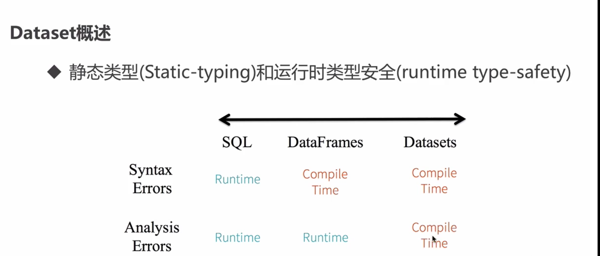
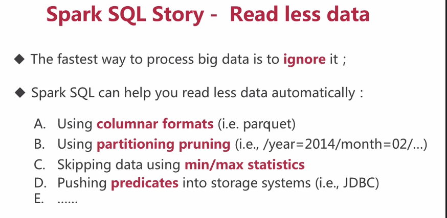
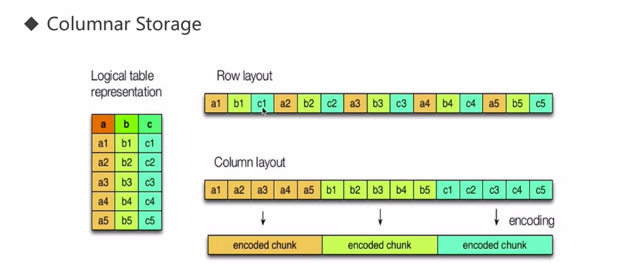
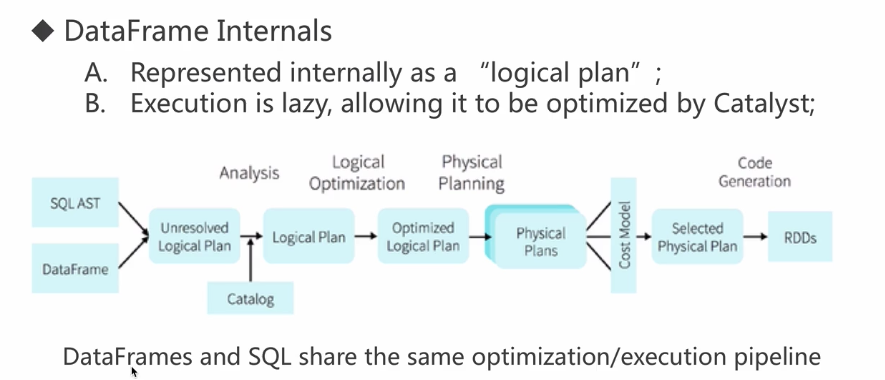
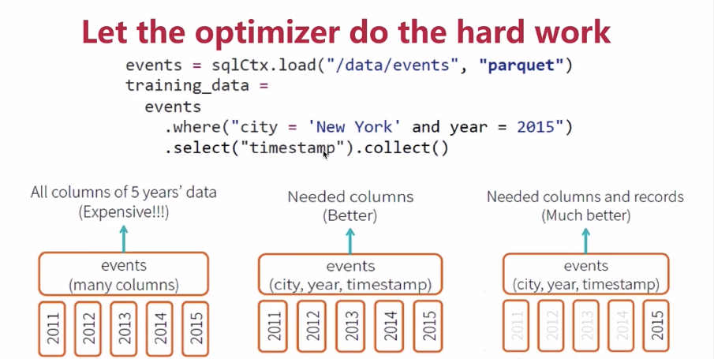
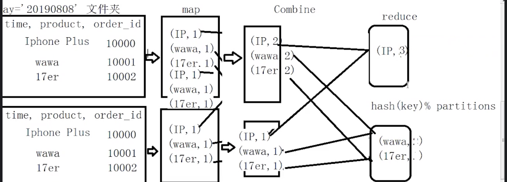

## 前言：
    -1, Spark 框架在企业中的使用非常广泛和Spark发展很快（有很多新功能特性），在很大程度上归功于SparkSQL模块
    -2, 在企业中使用HADOOP大数据框架进行数据分析的时候
        其实编写MapReduce程序并不多，反而使用Hive的更多
    -3, 提供编程语言大众化【情人】工具
        SQL：传统数据分析和挖掘更多的是编写SQL语句
    -4, 类似
        SparkCore           --          Hadoop MapReduce 
          RDD                              (key, value)
           |                                    |
        Shark/SparkSQL                        Hive 

## 更好的学习使用SparkSQL
    - Hive
    - SparkCore
    - 提醒一点
        深入使用和学习的话，必须阅读源码，核心的几个源代码
            导入源码/关联源码
            
    Spark Framework 
        三个基础模块：都是对要处理的数据进行封装，然后调用API进行处理
        - SparkCore 
            批处理：RDD， 最基础的数据结构
            HDFS/HBase   - 最常见的读取数据的地方
        - SparkSQL 
            交互式处理：DataFrame/Dataset = RDD + schema(模式)
            最强大的一点：
                External DataSources API 
                    读取存储在任何地方的数据，任何格式的数据
            HIVE/HDFS/JSON/CSV/TSV/JDBC/......
        - SparkSteaming
            流式处理：DStream(离散的流)= RDDs
            Kafka/Flume
        高级数据分析模块
            - GraphX
                图形计算：基于RDD，现在也出现基于DataFrame
            - MLlib
                机器学习库：两类API，RDD(mllib)和DataFrame(ml)

## Hive:   
        - SQL on HADOOP 框架家族中最基础最根本的框架。
        - 大数据仓库：
            给用户提供编写SQL，将SQL转换为MapReduce程序，读取HDFS上的数据运行在YARN的集群上。
        - Hive(SQL) -> MapReduce -> HDFS/YARN 
        
## Shark 
    - Hive(SQL0) -> Spark -> HDFS/YARN 
    - 思想：
        Hive的底层变为SparkCore：RDD的API在调用，将SQL转换为Spark程序
    - 读取Hive表中的数据，将SQL转换为SparkCore的RDD操作，运行在YARN上。
    - SparkSQL前身就是Shark 。
    - 思考：
        为什么Shark没有，被SparkSQL取代了呢？？？？
        - Shark模块属于Spark框架中的一个模块，将Hive的源代码拿来进行修改的，修改部分是：物理计划相关源码
                将SQL转换为MapReduce程序
            源码修改
                将SQL转换为SparkCore的RDD操作
        - Shark源码依赖于两部分：
            Hive的源码、Spark源码
            - SparkCore 版本升级的时候 - 性能好的时候， Shark需要升级
            - Hive 版本升级的时候，Shark也需要升级
        - 整个Shark框架更多的时候在进行维护操作，运维
    - 重用Hive部分的源代码
        SQL -> 解析  -> 逻辑计划  -> 物理计划

## 此时的SparkSQL功能非常的强大（Spark 1.3为正式版本）
    提供数据分析方式，不仅仅是SQL语句
    通过SQLContext读取外部数据源的数据，封装为DataFrame
    - SQL 
        HiveQL基本全部支持
        val df = sqlContext.sql("")  // 处理Hive表中的数据
        df.show()
    - DSL 
        就是调用DataFrame API 
        val df = sqlContext.read.table("emp").group("deptno").count.sort("count", desc)
        df.show()
        
## Dataframe是什么？

    DataFrame它不是Spark SQL提出的，而是早起在R、Pandas语言就已经有了的。
    
    
    A Dataset is a distributed collection of data：分布式的数据集
    
    A DataFrame is a Dataset organized into named columns. 
    以列（列名、列的类型、列值）的形式构成的分布式数据集，按照列赋予不同的名称
    
    student
    id:int
    name:string
    city:string
    
    It is conceptually equivalent to a table in a relational database 
    or a data frame in R/Python
    
#### Dataframe vs RDD
    RDD： 
    	java/scala  ==> jvm
    	python ==> python runtime
    
    
    DataFrame:
    	java/scala/python ==> Logic Plan
    	
    DataFrame和RDD互操作的两种方式：
    1）反射：case class   前提：事先需要知道你的字段、字段类型    
    2）编程：Row          如果第一种情况不能满足你的要求（事先不知道列）
    3) 选型：优先考虑第一种
    
### Datasets
    
    
    DataFrame = Dataset[Row]
    Dataset：强类型  typed  case class
    DataFrame：弱类型   Row
    
    
    SQL: 
        seletc name from person;  compile  ok, result no
    
    DF:
        df.select("name")  compile no
        df.select("nname")  compile ok  
    
    DS:
        ds.map(line => line.itemid)  compile no
        

### External Data Source API

    用户：
    	方便快速从不同的数据源（json、parquet、rdbms），经过混合处理（json join parquet），
    	再将处理结果以特定的格式（json、parquet）写回到指定的系统（HDFS、S3）上去
    	
#### HIve
      spark.sql("select deptno, count(1) as mount from emp where group by deptno").filter("deptno is not null").show
      spark.sql("select deptno, count(1) as mount from emp where group by deptno").filter("deptno is not null").write.saveAsTable("hive_table_1")
      spark.sqlContext.setConf("spark.sql.shuffle.partitions","10")

      在生产环境中一定要注意设置spark.sql.shuffle.partitions，默认是200
      
#### MYSQL
    操作MySQL的数据:
    val jdbcDF = spark.read.format("jdbc").option("url", "jdbc:mysql://localhost:3306/hadoop_hive").option("dbtable", "hadoop_hive.TBLS").option("user", "root").option("password", "root").option("driver", "com.mysql.jdbc.Driver").load()
    jdbcDF.printSchema
    
    import java.util.Properties
    val connectionProperties = new Properties()
    connectionProperties.put("user", "root")
    connectionProperties.put("password", "root")
    connectionProperties.put("driver", "com.mysql.jdbc.Driver")
    
    val jdbcDF2 = spark.read.jdbc("jdbc:mysql://localhost:3306", "hive.TBLS", connectionProperties)
    
### Spark 愿景

列式存储，分区存储，索引过滤，数据源过滤

- 更好压缩比
- 能够更好的查询

##### SparkSQL 优化

  
## SparkSQL 其他

### SparkSQL  使用场景
    - Spark SQL 
        即席查询
        普通查询
        Ad-hoc querying of data in files
        ETL 
        Database
        
### SparkSQL 读取
    - Dataframe
    - RDD
    - local/cloud
    val masterLog = sc.textFile("file:///home/hadoop/app/spark-2.1.0-bin-2.6.0-cdh5.7.0/logs/spark-hadoop-org.apache.spark.deploy.master.Master-1-hadoop001.out")
    val workerLog = sc.textFile("file:///home/hadoop/app/spark-2.1.0-bin-2.6.0-cdh5.7.0/logs/spark-hadoop-org.apache.spark.deploy.worker.Worker-1-hadoop001.out")
    val allLog = sc.textFile("file:///home/hadoop/app/spark-2.1.0-bin-2.6.0-cdh5.7.0/logs/*out*")
         
    

### 从Cloud读取数据: HDFS/S3
    val hdfsRDD = sc.textFile("hdfs://path/file")
    val s3RDD = sc.textFile("s3a://bucket/object")
        s3a/s3n
    
    spark.read.format("text").load("hdfs://path/file")
    spark.read.format("text").load("s3a://bucket/object")

### SaveMode
    Append
    Overwrite
    Ignore
    
### Json
    spark.read.format("json").load("file:///Users/hui/Desktop/Hadoop/Spark-SQL/Spark-SQL/Spark-SQL/sparksql-train/data/test.json")
    spark.sql("select name,explode(nums) from json_table").show()

 
## 自定义数据源
    BaseRelation:定义数据的schema信息，把我们的数据转成RDD[Row]
    RelationProvider:是一个relation的提供者，创建BaseRelation
    TableScan：读取数据并构建行，拿出所有的数据
    PrunedScan:列裁剪的
    PrunedFilteredScan：列裁剪➕过滤
    
    InsertableRelation：回写数据的relation
    
## SparkSQL 优化
       一：资源设置
           core  memory executor-num
           executor  driver
       
           1）--executor-memory MEM    1G        每个executor的内存大小
               Cache
               shuffle
               task
       
           2）--executor-cores NUM     1         每个executor的cpu core数量
               4exe *  2core = 8个
               4exe *  4core = 16个
       
           3）--num-executors          2         executor的数量
               4exe *  2core = 8个
               8exe *  2core = 16个
       
               100task  ？ * 2 ？
       
           4）--queue                  root.用户名   运行的队列

## Spark 广播变量
    
    50exe  1000task
    
    val params = ...  // 10M
    val rdd = ...
    rdd.foreach(x=>{...params...})
    
    1000task * 10M = 10G
    50exe * 10M = 500M
    val broadcastVar = sc.broadcast(Array(1, 2, 3))
    broadcastVar.value
    
    
Spark SQL：
    coalesce repartition
    
    
### Spark SQL 语句

    - select 语句 
    直接读取文件，直接从spark读取文件个数的分区，Spark一定是窄依赖
    完全没有shuffle
    
    - group by
    在reduceByKey会出现问题
    

    
    - join
        